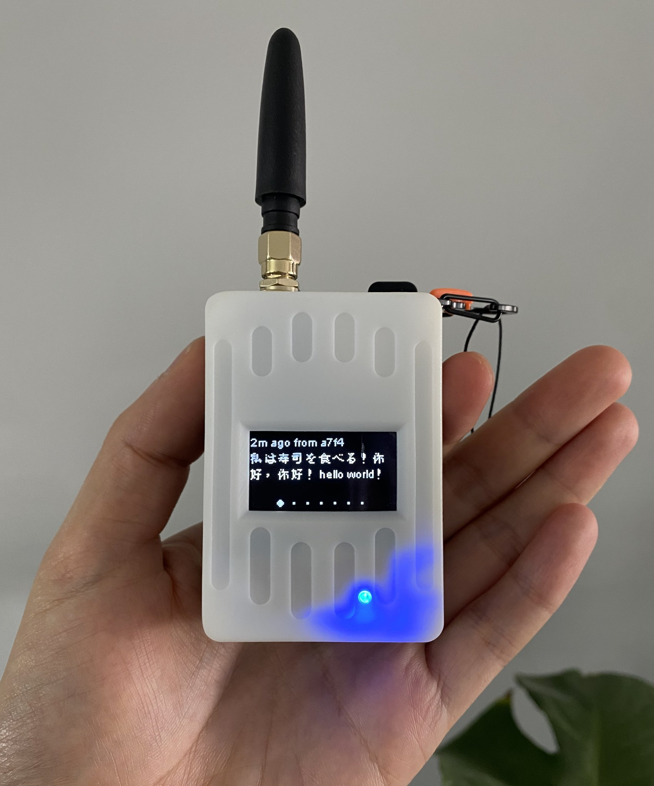
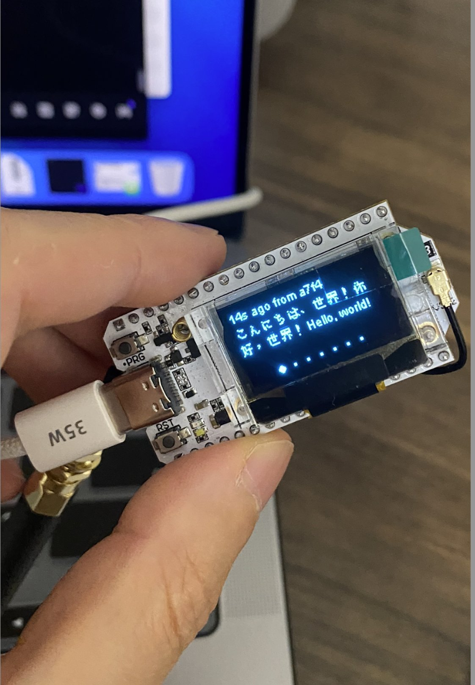

# Meshtastic CJK Releases

Precompiled CJK firmware binaries for Meshtastic-compatible devices.

## ⚠️ Important Notice

> **All data in this project, including languages, texts, and firmware programs, is for testing purposes only. The author of this project bears no responsibility for any problems arising from its use or for any violations of local laws.**

## ✍️ Modifications & Maintainer Note

This repository and its firmware builds are **unofficial** and maintained by **TSAO** (hey꩜tsao.dev).
All changes, including device support extensions and CJK font integrations, are made independently and provided under the same GPLv3 license as the original Meshtastic project.

You are free to use, modify, and redistribute this work under the terms of the GPLv3.  
However, I kindly ask that you **do not sell these binaries commercially**, though this is a non-binding request (permissible use is governed solely by the GPLv3 license).

Original Meshtastic Project: [https://github.com/meshtastic](https://github.com/meshtastic)

## 🚀 Usage

- Flash via [Web Flasher](https://flasher.meshtastic.org), or
- Download from [Releases](https://github.com/csrutil/meshtastic-releases) and flash manually.

## 📱 Devices

Supports ESP32, nRF52 boards.

### Device Images

| **Device Name**                   | **Brand**    | **Category**   | **Key Features**                         |
| --------------------------------- | ------------ | -------------- | ---------------------------------------- |
| **GAT562 EVB Pro**                | GAT-IoT      | Tracker Board  | Pro evaluation board variant             |
| **GAT562 Solar Relay**            | GAT-IoT      | Relay Node     | Solar-powered relay device               |
| **GAT562 Tracker (Trial)**        | GAT-IoT      | Tracker        | Out-of-box trial version                 |
| **Heltec Mesh Node T114**         | Heltec       | Mesh Node      | T114 variant for mesh communication      |
| **Heltec Pocket 5000 (Ink HUD)**  | Heltec       | Pocket Device  | 5,000mAh battery, e-ink display          |
| **Heltec Pocket 10000 (Ink HUD)** | Heltec       | Pocket Device  | 10,000mAh battery, e-ink display         |
| **Heltec V3**                     | Heltec       | General Device | 3rd generation multipurpose device       |
| **Heltec Wireless Tracker**       | Heltec       | Tracker        | Wireless tracking device                 |
| **WIO Tracker L1**                | Seeed Studio | Tracker        | Compact GPS-enabled tracking board       |
| **nRF52 Pro Micro (TCXO)**        | DIY / Nordic | DIY Board      | With temp-compensated crystal oscillator |
| **nRF52 Pro Micro (XTAL)**        | DIY / Nordic | DIY Board      | With standard crystal oscillator         |

## ⚠️ Disclaimer

> Not an official repo unless stated.  
> All binaries and configurations are provided without warranty.  
> No responsibility for damages or bug fixes.  
> Beam me up if you want the patch files or you can download here [CJK patch](https://github.com/whywilson/meshtastic-firmware/commit/fd672aa0e4172a28f2c4f06c9b8d1b4ab86aacb6#diff-efc04cdb1a550eb433fb6d101f1de4c358546a8b02a7e0b5b17256f60d6e0869).

> **CJK Implementation Notice**: The CJK text display feature and related ideas belong to TSAO. This implementation includes comprehensive support for Chinese, Japanese, and Korean character rendering with advanced mixed-content text processing capabilities.
